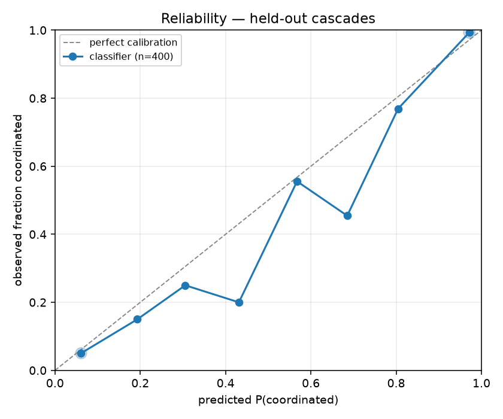

# Results

Measured outputs from the ML pipeline. Every table here is regenerated by a
script — do not edit by hand.

## Virality classifier — cross-validation

LightGBM with 37 features and hyperparameters tuned by Optuna on the training split (`ml/tuned_params.json`), positive class =
`coordinated`. 5-fold stratified
cross-validation on the training split only (1600 cascades); 400
cascades are held out for `ml/evaluate.py` and never seen here.

| metric | mean | std | min | max |
|---|---|---|---|---|
| precision | 0.917 | 0.013 | 0.908 | 0.940 |
| recall | 0.871 | 0.052 | 0.790 | 0.920 |
| f1 | 0.893 | 0.030 | 0.845 | 0.917 |
| roc_auc | 0.946 | 0.022 | 0.915 | 0.970 |
| pr_auc | 0.958 | 0.015 | 0.937 | 0.971 |

### Feature importance (gain)

| feature | gain | share |
|---|---|---|
| log_delay_std | 2,556 | 19.0% |
| prior_author_frac_ge3 | 2,024 | 15.0% |
| log_delay_iqr | 1,726 | 12.8% |
| prior_author_p75 | 784 | 5.8% |
| coauthor_linked_frac | 692 | 5.1% |
| cross_platform_edge_frac | 606 | 4.5% |
| leaf_frac | 532 | 4.0% |
| prior_author_mean | 522 | 3.9% |
| first_hop_lag_s | 448 | 3.3% |
| coauthor_overlap_max | 325 | 2.4% |
| root_attach_mle | 311 | 2.3% |
| mean_children | 302 | 2.2% |

Reproduce with `python -m ml.train`.

## Anomaly baselines — replay comparison

Every topic's mention stream replayed through the production `VelocityScorer`
and `AnomalyDetector` at a 300s tick (50 topics). A detection is
*explained* if a cascade began on that topic within
60 minutes before it; unexplained detections
fired on baseline noise and are the false positives.

Organic bursts are not counted as false positives. Genuine virality is real
anomalous velocity — separating it from a campaign is the classifier's job, and
a detector that stayed silent for it would starve the agent of the harder half
of its cases.

| baseline | detections | coord. recall | organic recall | FP rate | FP / topic-day | median delay (min) |
|---|---|---|---|---|---|---|
| `zscore` | 1,457 | 0.850 | 0.790 | 0.520 | 4.99 | 3.3 |
| `robust` | 1,088 | 0.736 | 0.706 | 0.206 | 1.48 | 3.4 |
| `ewma` | 1,518 | 0.894 | 0.857 | 0.653 | 6.54 | 3.1 |
| `poisson` | 2,136 | 0.972 | 0.950 | 0.322 | 4.53 | 3.2 |
| `negbin` | 1,059 | 0.913 | 0.798 | 0.195 | 1.36 | 3.2 |
| `cusum` | 2,552 | 0.988 | 0.975 | 0.395 | 6.64 | 3.2 |

Reproduce with `python -m ml.eval_anomaly`.

## Filtered vector search — recall

A 10,000-vector corpus in which the `(model_name, model_version)` filter keeps
only the stated share of rows. Recall@5 is measured against a sequential scan,
exact by construction, over 100 queries per row, with `hnsw.ef_search`
pinned equal across both configurations so the comparison is about the filter and
not about search effort.

| filter keeps | shared recall@5 | shared rows | partial recall@5 | partial rows |
|---|---|---|---|---|
| 5% | 0.486 | 2.46 / 5 | 0.980 | 5.00 / 5 |
| 10% | 0.338 | 4.23 / 5 | 0.870 | 5.00 / 5 |
| 20% | 0.342 | 4.89 / 5 | 0.674 | 5.00 / 5 |

The table-wide index never returns a full result set: it walks the graph unaware
of the filter, and neighbours from the other model version are discarded *after*
consuming the candidate budget. At 5% selectivity a query asking for 5 rows gets
under 3. Nothing raises an error — `search_similar` simply returns a short,
degraded list, which is why this survived until it was measured.

A partial index returns the full 5 rows at every selectivity, because every row
it contains already satisfies the predicate and the entire walk is usable.

The table-wide index walks the graph without knowing about the filter, so
neighbours from the other model version are found first and dropped afterwards.
Nothing errors — the query just returns fewer and worse rows. A partial index
contains only rows that already satisfy the predicate, so the entire walk counts.

pgvector's `iterative_scan` addresses this generally but needs 0.8+; the bundled
build is 0.6.2. A partial index is sufficient here because the filter is
low-cardinality and known ahead of time. `graph.embeddings.ensure_partial_index`
creates one for the active model version, and the background indexer calls it on
startup.

Reproduce with `python -m ml.eval_retrieval`.

## Classifier vs LLM agent — held-out comparison

All arms scored on the same temporally held-out split (400 cascades;
the LLM arms are sampled from it, `n` below).

| arm | n | accuracy | macro F1 | ROC-AUC | Brier |
|---|---|---|---|---|---|
| `classifier` | 400 | 0.890 | 0.889 | 0.938 | 0.086 |
| `llm` | 15 | 0.667 | 0.603 | 0.571 | 0.237 |
| `hybrid` | 16 | 0.438 | 0.435 | 0.359 | 0.345 |

### Per class

Reported both ways because the arms fail differently — an arm can look strong on
`coordinated` while misclassifying most organic cascades, which a single
positive-class F1 hides.

| arm | class | precision | recall | F1 |
|---|---|---|---|---|
| `classifier` | coordinated | 0.906 | 0.859 | 0.882 |
| `classifier` | organic | 0.877 | 0.919 | 0.897 |
| `llm` | coordinated | 0.615 | 1.000 | 0.762 |
| `llm` | organic | 1.000 | 0.286 | 0.444 |
| `hybrid` | coordinated | 0.429 | 0.375 | 0.400 |
| `hybrid` | organic | 0.444 | 0.500 | 0.471 |



Investigations that returned no parseable verdict: `llm` 5, `hybrid` 4. They are
excluded rather than counted as wrong — each arm is measured on the answers it
actually gives, and the count is reported so the omission stays visible.

**The LLM arms are underpowered and should not be ranked against each other.**
Each rests on fewer than twenty verdicts, and repeated runs move them further
than the gap between them: across two runs of the same sample the `llm` arm
scored ROC-AUC 0.602 and then 0.424, a swing of nearly 0.2 on an arm that never
touches the classifier and so should not have changed at all. Sampling noise is
larger than the effect. What the numbers do support is the coarse conclusion —
a local 7B reasoning over graph structure is somewhere around chance at this
task, and nowhere near the classifier's 0.938. Separating "LLM alone" from
"LLM with the model tool" needs a stronger model and a sample in the hundreds,
which is a rate-limit and runtime problem rather than a design one.

### By cascade subtype

| subtype | n | accuracy |
|---|---|---|
| `plain` | 340 | 0.941 |
| `stealth_coordinated` | 28 | 0.393 |
| `viral_organic` | 32 | 0.781 |

The simulator generates a fraction of each class as a confusable subtype:
`viral_organic` cascades that burst like a campaign, and `stealth_coordinated`
ones that pace themselves and rotate accounts. They should be measurably harder
than the plain cases, and are — which is the evidence that the overlap built into
the generator is doing real work rather than decorating the dataset.

### Human-review gate

`CONFIDENCE_THRESHOLD` was a guessed 0.65. Read off the classifier's reliability
curve, the lowest gate whose retained predictions reach
90% accuracy is **0.55**, which holds
90.7% accuracy while auto-publishing
96.8% of cases. The remainder goes to a human.

Lowest rather than safest: every extra point of threshold buys accuracy by
sending more cases to review, so the cheapest gate that clears the bar is the
right one. Re-derive after any retrain — the number is a property of the fitted
model, not a constant.

Reproduce with `python -m ml.evaluate`.

## Learned deferral — knowing when not to answer

**This is a negative result, kept because it is one.** Learned deferral was
built to replace confidence gating and does not beat it.

The motivation was real. Confidence gating assumes a prediction the classifier
is sure about is a prediction likely to be right, and on an earlier build that
failed badly — published `viral_organic` cascades scored 0.474, worse than
chance. That turned out to be a *feature bug*, not a gating problem: author
reuse was counted cumulatively from the start of the dataset, so it grew without
bound and meant something different either side of a temporal split. Windowing
it fixed the gate as a side effect, and `viral_organic` went from 0.500 to 0.781
with no change to the gate at all.

Deferral was implemented anyway, to test whether difficulty is learnable. A
second LightGBM predicts *whether the classifier will be correct*, from the
cascade's own shape plus the verdict the classifier gave it, with labels taken
from out-of-fold predictions — scoring the classifier on rows it trained on
would show it correct almost everywhere and teach the deferral model that
nothing is hard.

It matches confidence gating and does not beat it (0.958 against
0.957 at the same coverage). The subtype table below says
why: both gates publish a quarter of `stealth_coordinated` and get *every one*
wrong. Those cascades are generated to look organic — paced timing, rotated
accounts — so they are close to indistinguishable in the feature space both
models read. A deferral model looking at the same features cannot flag what the
classifier cannot separate; the difficulty is irreducible here, not something a
better gate recovers.

The conclusion that follows is about features, not gating: catching careful
campaigns needs signals these features do not carry — account age, or
coordination structure across cascades rather than within one.

### Gate comparison, at matched coverage

Both gates publish the same share of cases, so the only difference is *which*
cases each one keeps.

| target accuracy | deferral threshold | deferral accuracy | coverage | confidence accuracy at same coverage |
|---|---|---|---|---|
| 0.900 | 0.31 | 0.901 | 98.0% | 0.900 |
| 0.925 | 0.82 | 0.928 | 83.2% | 0.928 |
| 0.950 | 0.98 | 0.958 | 53.0% | 0.957 |
| 0.970 | 0.98 | 0.958 | 53.0% | 0.957 |

### Where each gate publishes, by subtype

`published` is the share auto-published; `accuracy` is measured on those only.
The confusable subtypes are where the confidence gate broke.

| subtype | gate | n | published | accuracy once published |
|---|---|---|---|---|
| `plain` | confidence | 340 | 0.57 | 0.990 |
| `plain` | deferral | 340 | 0.58 | 0.990 |
| `stealth_coordinated` | confidence | 28 | 0.25 | 0.000 |
| `stealth_coordinated` | deferral | 28 | 0.25 | 0.000 |
| `viral_organic` | confidence | 32 | 0.22 | 1.000 |
| `viral_organic` | deferral | 32 | 0.25 | 1.000 |

### What ships

Confidence gating stays in `agent/confidence.py`. Deferral matches it and costs a
second model plus a second artefact to keep in sync, so it is not wired into the
runtime — added complexity has to buy something measurable. The module and this
table remain as the record of what was tried.

Out-of-fold classifier accuracy is 0.863, so both gates are choosing
between genuinely uncertain outcomes rather than reading an easy signal.

Reproduce with `python -m ml.deferral`.

## Live traffic — observed cascades

Live Bluesky and Hacker News traffic ingested through the real producer
serialisation and `processing.consumer.handle()` — dedup, spaCy NER, graph
writes, velocity scoring and anomaly detection — with Kafka omitted as transport
(see `scripts/ingest_live.py`).

### What was ingested

| platform | edge type | count |
|---|---|---|
| bluesky | `authored` | 133,174 |
| bluesky | `reshare` | 103,544 |
| bluesky | `mentions` | 57,875 |
| hn | `authored` | 353 |
| hn | `mentions` | 215 |

| platform | node type | count |
|---|---|---|
| bluesky | `content` | 174,718 |
| bluesky | `author` | 50,898 |
| bluesky | `named_entity` | 35,947 |
| hn | `content` | 353 |
| hn | `author` | 267 |
| hn | `named_entity` | 166 |

### Observed cascade shape

| metric | cascades | p50 | p90 | max |
|---|---|---|---|---|
| size (posts) | 3,000 | 2 | 5 | 126 |
| depth | 3,000 | 1 | 2 | 13 |

A firehose is a sample, not an archive: a reply whose parent was never captured
still forms a two-node tree, so the distribution is dominated by small cascades.
980 of 3,000 observed cascades reach 3+ posts.

### Does the simulator resemble reality?

| feature | real p50 | real p90 | simulated p50 | simulated p90 |
|---|---|---|---|---|
| `size` | 4.00 | 9.00 | 27.00 | 75.00 |
| `max_depth` | 1.00 | 2.00 | 4.00 | 6.00 |
| `root_fanout_share` | 1.00 | 1.00 | 0.51 | 0.82 |
| `leaf_frac` | 0.67 | 0.88 | 0.63 | 0.80 |
| `delay_median_s` | 236.97 | 685.99 | 140.92 | 892.31 |

This is the check on everything trained upstream, and it splits two ways.

**Timing transfers.** Median inter-arrival delay and leaf fraction land close to
the simulated values, so the temporal model the classifier leans on describes
something real.

**Structure does not.** Observed cascades are far smaller and shallower, with
root fan-out share pinned near 1.0 — almost every captured reply attaches
directly to a seed. That is mostly sampling: from a firehose you see replies to a
post far more often than replies to replies, so deep chains are invisible even
where they exist. It is not evidence that real cascades are flat.

### Classifier applied to live traffic

| P(coordinated) | cascades | share |
|---|---|---|
| 0.0–0.2 | 633 | 64.6% |
| 0.2–0.4 | 143 | 14.6% |
| 0.4–0.6 | 114 | 11.6% |
| 0.6–0.8 | 68 | 6.9% |
| 0.8–1.0 | 22 | 2.2% |

Reported as a distribution, not accuracy. Real cascades carry no ground-truth
label — that absence is precisely why the simulator exists — so what the model
asserts about live data is measurable, and whether it is correct is not.

**These scores are out of domain and should be read as such.** `max_depth` and
`root_fanout_share` are among the classifier's inputs, and both sit far outside
the range it was trained on. A model asked about inputs it has never seen will
still return a confident number, and that number is not trustworthy just because
it is well-formed. Closing this gap needs either a longer, denser capture that
reconstructs whole threads — backfilling parents through the API rather than
waiting for them to float past — or a simulator whose sampling mirrors what a
firehose actually reveals.

### One observed propagation

```
seed  ·  (not captured)
  +      0s  depth 1  (repost)
  +      9s  depth 1  (repost)
  +     11s  depth 1  (repost)
  +     12s  depth 1  (repost)
  +     29s  depth 1  (repost)
  +     86s  depth 1  (repost)
  +     89s  depth 1  (repost)
  +     90s  depth 1  (repost)
  +    112s  depth 1  (repost)
  +    118s  depth 1  Just saw it on Labor Day, and I loved it! This movie deserves its crowning achie
  +    163s  depth 1  (repost)
  +    163s  depth 1  (repost)
```

Reproduce with `python -m scripts.ingest_live --minutes 20` then
`python -m ml.analyze_real`.

## Classifier experiments — training-split CV

Every arm scored on the same 5-fold x 2-repeat stratified split of
the temporal training split (1600 cascades), so fold-to-fold differences
are paired. The holdout is not used here. Optuna runs 30 TPE trials per
outer fold on 3 inner folds of that fold's training rows (nested), so
the tuned arm is not scored on data its search saw. The GNN trains for
30 epochs per fold with no early stopping (no inner validation to stop on).

| arm | what it is |
|---|---|
| `logreg (all features)` | Logistic regression, standardised — a linear floor |
| `lgbm (base features)` | The shipped model: original 23 features, original params |
| `lgbm (+ new features)` | Original params, 37 features |
| `lgbm (+ new, Optuna)` | 37 features, params tuned per outer fold (nested) |
| `lgbm (+ new, Optuna, isotonic)` | Tuned, then isotonic calibration on inner folds |
| `GIN (tree GNN)` | Graph neural network on the reshare tree itself |
| `GIN + lgbm (mean)` | Average of the GNN and the tuned LightGBM probabilities |

| arm | macro F1 | ROC-AUC | PR-AUC | Brier | ECE | stealth_coord. acc | viral_organic acc |
|---|---|---|---|---|---|---|---|
| `logreg (all features)` | 0.888 ± 0.022 | 0.939 ± 0.021 | 0.953 ± 0.014 | 0.088 ± 0.016 | 0.053 ± 0.007 | 0.393 ± 0.158 | 0.783 ± 0.078 |
| `lgbm (base features)` | 0.864 ± 0.027 | 0.930 ± 0.021 | 0.943 ± 0.016 | 0.105 ± 0.021 | 0.074 ± 0.021 | 0.439 ± 0.119 | 0.734 ± 0.112 |
| `lgbm (+ new features)` | 0.899 ± 0.024 | 0.947 ± 0.019 | 0.959 ± 0.013 | 0.085 ± 0.020 | 0.064 ± 0.020 | 0.434 ± 0.148 | 0.767 ± 0.040 |
| `lgbm (+ new, Optuna)` | 0.897 ± 0.023 | 0.948 ± 0.019 | 0.960 ± 0.013 | 0.082 ± 0.017 | 0.045 ± 0.010 | 0.425 ± 0.148 | 0.753 ± 0.071 |
| `lgbm (+ new, Optuna, isotonic)` | 0.899 ± 0.022 | 0.948 ± 0.020 | 0.957 ± 0.015 | 0.082 ± 0.017 | 0.045 ± 0.012 | 0.421 ± 0.152 | 0.749 ± 0.062 |
| `GIN (tree GNN)` | 0.858 ± 0.019 | 0.920 ± 0.024 | 0.938 ± 0.015 | 0.109 ± 0.018 | 0.064 ± 0.021 | 0.387 ± 0.118 | 0.740 ± 0.075 |
| `GIN + lgbm (mean)` | 0.889 ± 0.023 | 0.944 ± 0.020 | 0.956 ± 0.014 | 0.087 ± 0.017 | 0.045 ± 0.019 | 0.414 ± 0.129 | 0.787 ± 0.059 |

### Paired difference against the shipped model

Mean ± std of the per-fold difference, and how many of the
10 folds the arm won. Lower Brier is better.

| arm | Δ macro F1 | Δ ROC-AUC | Δ Brier |
|---|---|---|---|
| `logreg (all features)` | +0.024 ± 0.017 (10/10) | +0.010 ± 0.005 (10/10) | -0.017 ± 0.008 (10/10) |
| `lgbm (+ new features)` | +0.035 ± 0.014 (10/10) | +0.017 ± 0.006 (10/10) | -0.021 ± 0.009 (10/10) |
| `lgbm (+ new, Optuna)` | +0.033 ± 0.015 (10/10) | +0.018 ± 0.005 (10/10) | -0.023 ± 0.008 (10/10) |
| `lgbm (+ new, Optuna, isotonic)` | +0.035 ± 0.017 (10/10) | +0.018 ± 0.006 (10/10) | -0.023 ± 0.010 (10/10) |
| `GIN (tree GNN)` | -0.006 ± 0.015 (4/10) | -0.009 ± 0.009 (1/10) | +0.004 ± 0.008 (3/10) |
| `GIN + lgbm (mean)` | +0.025 ± 0.014 (9/10) | +0.014 ± 0.005 (10/10) | -0.019 ± 0.007 (10/10) |

Reproduce with `python -m ml.experiment cv`.

## Anomaly baselines — tuned on held-out topics (300s clock ticks)

Each topic is scored on a 300s clock, like the fixed-threshold table.

The fixed-threshold table fixes every detector at 2.5, which is not a fair
fight: each baseline's z-scale means something different. Here each one is
swept, its threshold is chosen on **50 tuning topics** (the ones in the
fixed-threshold replay table), and the chosen operating points are then scored on
**150 different topics** that none of the choices saw.

Selection rule: the fewest false alarms per topic-day among thresholds whose
coordinated recall on the tuning topics reaches the previous default's
(`robust` at 2.5: 0.736). That holds recall fixed and
asks which detector pays the least noise for it.

### Held-out topics, at the tuned thresholds

| detector | detections | coord. recall | organic recall | FP rate | FP / topic-day | median delay (min) |
|---|---|---|---|---|---|---|
| `robust` @ 2.5 (previous default) | 3,448 | 0.745 | 0.690 | 0.226 | 1.72 | 4.0 |
| `zscore` @ 5 (tuned) | 1,218 | 0.717 | 0.552 | 0.093 | 0.25 | 3.7 |
| `ewma` @ 5 (tuned) | 1,183 | 0.775 | 0.559 | 0.145 | 0.38 | 3.6 |
| `poisson` @ 5 (tuned) | 1,737 | 0.800 | 0.593 | 0.013 | 0.05 | 3.7 |
| `negbin` @ 3.5 (tuned) | 1,477 | 0.716 | 0.552 | 0.030 | 0.10 | 3.7 |
| `cusum` @ 8 (tuned) | 2,014 | 0.808 | 0.728 | 0.080 | 0.36 | 4.8 |

### Tuning-topic sweep

`pareto` marks points that no other detector/threshold beats on both false
alarms and coordinated recall.

| baseline | threshold | coord. recall | FP / topic-day | median delay (min) | pareto |
|---|---|---|---|---|---|
| `zscore` | 2 | 0.906 | 9.01 | 3.2 |  |
| `zscore` | 2.5 | 0.850 | 4.99 | 3.3 |  |
| `zscore` | 3 | 0.827 | 2.56 | 3.3 |  |
| `zscore` | 3.5 | 0.807 | 1.48 | 3.3 |  |
| `zscore` | 4 | 0.799 | 0.80 | 3.4 |  |
| `zscore` | 5 | 0.748 | 0.23 | 3.4 |  |
| `zscore` | 6 | 0.654 | 0.11 | 3.4 |  |
| `robust` | 2 | 0.764 | 5.84 | 3.4 |  |
| `robust` | 2.5 | 0.736 | 1.48 | 3.4 |  |
| `robust` | 3 | 0.713 | 0.75 | 3.6 |  |
| `robust` | 3.5 | 0.665 | 0.27 | 3.6 |  |
| `robust` | 4 | 0.665 | 0.27 | 3.6 |  |
| `robust` | 5 | 0.594 | 0.04 | 3.6 |  |
| `robust` | 6 | 0.547 | 0.03 | 3.6 |  |
| `robust` | 8 | 0.417 | 0.00 | 3.4 |  |
| `ewma` | 2 | 0.909 | 11.04 | 3.0 |  |
| `ewma` | 2.5 | 0.894 | 6.54 | 3.1 |  |
| `ewma` | 3 | 0.886 | 3.88 | 3.2 |  |
| `ewma` | 3.5 | 0.862 | 2.08 | 3.3 |  |
| `ewma` | 4 | 0.835 | 1.15 | 3.3 |  |
| `ewma` | 5 | 0.744 | 0.40 | 3.3 |  |
| `ewma` | 6 | 0.673 | 0.18 | 3.3 |  |
| `ewma` | 8 | 0.610 | 0.03 | 3.4 |  |
| `poisson` | 2 | 0.988 | 10.92 | 3.0 |  |
| `poisson` | 2.5 | 0.972 | 4.53 | 3.2 | yes |
| `poisson` | 3 | 0.957 | 1.60 | 3.2 | yes |
| `poisson` | 3.5 | 0.925 | 0.59 | 3.3 | yes |
| `poisson` | 4 | 0.886 | 0.24 | 3.3 | yes |
| `poisson` | 4.5 | 0.874 | 0.09 | 3.4 | yes |
| `poisson` | 5 | 0.791 | 0.02 | 3.4 | yes |
| `poisson` | 6 | 0.713 | 0.00 | 3.3 | yes |
| `negbin` | 2 | 0.972 | 5.16 | 3.2 |  |
| `negbin` | 2.5 | 0.913 | 1.36 | 3.2 |  |
| `negbin` | 3 | 0.854 | 0.27 | 3.4 |  |
| `negbin` | 3.5 | 0.748 | 0.09 | 3.4 |  |
| `negbin` | 4 | 0.650 | 0.04 | 3.4 |  |
| `negbin` | 4.5 | 0.591 | 0.01 | 3.4 |  |
| `negbin` | 5 | 0.512 | 0.01 | 3.3 |  |
| `negbin` | 6 | 0.382 | 0.00 | 3.4 |  |
| `cusum` | 2 | 0.992 | 10.22 | 3.2 | yes |
| `cusum` | 3 | 0.972 | 4.55 | 3.2 |  |
| `cusum` | 4 | 0.953 | 2.23 | 3.4 |  |
| `cusum` | 5 | 0.909 | 1.21 | 3.6 |  |
| `cusum` | 6 | 0.882 | 0.74 | 4.0 |  |
| `cusum` | 8 | 0.780 | 0.36 | 4.4 |  |
| `cusum` | 10 | 0.693 | 0.20 | 5.4 |  |
| `cusum` | 12 | 0.630 | 0.11 | 6.1 |  |
| `cusum` | 15 | 0.543 | 0.10 | 8.3 |  |
| `cusum` | 20 | 0.382 | 0.03 | 9.4 |  |
| `cusum` | 25 | 0.256 | 0.01 | 15.0 |  |

Reproduce with `python -m ml.eval_anomaly --sweep --tick 300`.

## Anomaly baselines — clumped-chatter stress test (300s clock ticks)

The simulator's background chatter is a pure (diurnal) Poisson process — which
is exactly what the `poisson` detector assumes. A detector scored only in the
world it assumes is being flattered, so here the thresholds tuned above are
kept **unchanged** and re-scored on the same 150 held-out topics
with overdispersed chatter: every background mention gets a Poisson(`clumps`)
number of echoes about a minute and a half later. That is ordinary
conversation that clumps without being a cascade, and it is what real mention
counts look like. `clumps = 0` regenerates the database streams in memory and
reproduces the matching held-out table (up to float rounding).

| clumps | detector | coord. recall | organic recall | FP / topic-day | median delay (min) |
|---|---|---|---|---|---|
| 0 | `robust` @ 2.5 (previous default) | 0.745 | 0.690 | 1.73 | 3.9 |
| 0 | `zscore` @ 5 | 0.716 | 0.552 | 0.25 | 3.7 |
| 0 | `ewma` @ 5 | 0.775 | 0.558 | 0.38 | 3.6 |
| 0 | `poisson` @ 5 | 0.802 | 0.593 | 0.05 | 3.7 |
| 0 | `negbin` @ 3.5 | 0.713 | 0.551 | 0.10 | 3.7 |
| 0 | `cusum` @ 8 | 0.808 | 0.728 | 0.36 | 4.8 |
| 1 | `robust` @ 2.5 (previous default) | 0.830 | 0.772 | 11.42 | 4.0 |
| 1 | `zscore` @ 5 | 0.563 | 0.369 | 0.45 | 3.7 |
| 1 | `ewma` @ 5 | 0.621 | 0.382 | 0.91 | 3.6 |
| 1 | `poisson` @ 5 | 0.760 | 0.554 | 1.13 | 3.7 |
| 1 | `negbin` @ 3.5 | 0.485 | 0.286 | 0.10 | 3.8 |
| 1 | `cusum` @ 8 | 0.820 | 0.740 | 3.01 | 4.9 |
| 3 | `robust` @ 2.5 (previous default) | 0.787 | 0.698 | 15.31 | 3.9 |
| 3 | `zscore` @ 5 | 0.399 | 0.209 | 0.48 | 3.9 |
| 3 | `ewma` @ 5 | 0.426 | 0.215 | 0.87 | 3.7 |
| 3 | `poisson` @ 5 | 0.777 | 0.587 | 6.34 | 3.9 |
| 3 | `negbin` @ 3.5 | 0.261 | 0.112 | 0.06 | 3.9 |
| 3 | `cusum` @ 8 | 0.831 | 0.769 | 8.72 | 5.1 |

Reproduce with `python -m ml.eval_anomaly --sweep --tick 300`.

## Classifier upgrade — held-out result

The configuration chosen by cross-validation above, scored once on the
400 temporally held-out cascades (database copy, the same rows as
`ml/evaluate.py`), next to the original configuration refit on the same
training split. Nothing about the upgraded model was chosen by looking at
these rows.

| model | accuracy | macro F1 | ROC-AUC | PR-AUC | Brier | ECE |
|---|---|---|---|---|---|---|
| original — 23 features, default params | 0.890 | 0.889 | 0.938 | 0.952 | 0.086 | 0.059 |
| upgraded — 37 features, Optuna params | 0.910 | 0.910 | 0.960 | 0.969 | 0.069 | 0.044 |

Paired bootstrap over held-out cascades (2,000 resamples), upgraded minus
original: ROC-AUC +0.022 (95% CI +0.007 to +0.039),
macro F1 +0.020 (95% CI -0.003 to +0.045).

### By subtype

| subtype | n | original accuracy | upgraded accuracy |
|---|---|---|---|
| `plain` | 340 | 0.941 | 0.971 |
| `viral_organic` | 32 | 0.781 | 0.812 |
| `stealth_coordinated` | 28 | 0.393 | 0.286 |

### Review gate, re-derived

Lowest confidence gate whose published predictions reach
90% accuracy, read off each model's own held-out predictions.

| model | gate | accuracy above gate | auto-published |
|---|---|---|---|
| original | 0.55 | 0.907 | 96.8% |
| upgraded | 0.50 | 0.910 | 100.0% |

The `Classifier vs LLM agent` section predates this upgrade: its `classifier` row is
the original configuration, and the LLM arms have not been re-run (they need the
local model server).

Reproduce with `python -m ml.experiment holdout`.

## Anomaly baselines — tuned on held-out topics (per event, as deployed)

Each topic is scored on every arriving event, exactly as `processing.consumer` does in production — so the history a baseline is built from is a history of event-time samples, not of a clock.

The fixed-threshold table fixes every detector at 2.5, which is not a fair
fight: each baseline's z-scale means something different. Here each one is
swept, its threshold is chosen on **50 tuning topics** (the ones in the
fixed-threshold replay table), and the chosen operating points are then scored on
**150 different topics** that none of the choices saw.

Selection rule: the fewest false alarms per topic-day among thresholds whose
coordinated recall on the tuning topics reaches the previous default's
(`robust` at 2.5: 0.811). That holds recall fixed and
asks which detector pays the least noise for it.

No threshold in the grid reaches that recall for `ewma`, `negbin`; left out of the table below.

### Held-out topics, at the tuned thresholds

| detector | detections | coord. recall | organic recall | FP rate | FP / topic-day | median delay (min) |
|---|---|---|---|---|---|---|
| `robust` @ 2.5 (previous default) | 17,535 | 0.832 | 0.730 | 0.035 | 1.35 | 0.8 |
| `zscore` @ 2 (tuned) | 21,422 | 0.855 | 0.791 | 0.162 | 7.69 | 0.7 |
| `poisson` @ 3 (tuned) | 20,420 | 0.819 | 0.636 | 0.003 | 0.13 | 0.9 |
| `cusum` @ 12 (tuned) | 8,083 | 0.846 | 0.684 | 0.004 | 0.08 | 1.1 |

### Tuning-topic sweep

`pareto` marks points that no other detector/threshold beats on both false
alarms and coordinated recall.

| baseline | threshold | coord. recall | FP / topic-day | median delay (min) | pareto |
|---|---|---|---|---|---|
| `zscore` | 2 | 0.843 | 8.08 | 0.7 |  |
| `zscore` | 2.5 | 0.791 | 4.14 | 0.7 |  |
| `zscore` | 3 | 0.732 | 1.97 | 0.8 |  |
| `zscore` | 3.5 | 0.606 | 0.88 | 0.7 |  |
| `zscore` | 4 | 0.437 | 0.32 | 0.6 |  |
| `zscore` | 5 | 0.043 | 0.01 | 0.4 |  |
| `zscore` | 6 | 0.000 | 0.01 | n/a |  |
| `robust` | 2 | 0.870 | 4.88 | 0.7 |  |
| `robust` | 2.5 | 0.811 | 1.31 | 0.8 |  |
| `robust` | 3 | 0.783 | 0.53 | 0.8 |  |
| `robust` | 3.5 | 0.740 | 0.15 | 0.9 |  |
| `robust` | 4 | 0.732 | 0.15 | 0.9 |  |
| `robust` | 5 | 0.661 | 0.03 | 1.0 |  |
| `robust` | 6 | 0.583 | 0.02 | 0.9 |  |
| `robust` | 8 | 0.457 | 0.00 | 1.0 |  |
| `ewma` | 2 | 0.772 | 8.79 | 0.5 |  |
| `ewma` | 2.5 | 0.504 | 3.80 | 0.6 |  |
| `ewma` | 3 | 0.154 | 1.09 | 0.4 |  |
| `ewma` | 3.5 | 0.028 | 0.30 | 0.3 |  |
| `ewma` | 4 | 0.004 | 0.11 | 0.1 |  |
| `ewma` | 5 | 0.000 | 0.01 | n/a |  |
| `ewma` | 6 | 0.000 | 0.01 | n/a |  |
| `ewma` | 8 | 0.000 | 0.00 | n/a |  |
| `poisson` | 2 | 0.921 | 1.49 | 0.7 |  |
| `poisson` | 2.5 | 0.874 | 0.36 | 0.8 | yes |
| `poisson` | 3 | 0.815 | 0.09 | 0.9 |  |
| `poisson` | 3.5 | 0.748 | 0.01 | 0.9 | yes |
| `poisson` | 4 | 0.693 | 0.00 | 0.9 | yes |
| `poisson` | 4.5 | 0.654 | 0.00 | 1.0 |  |
| `poisson` | 5 | 0.587 | 0.00 | 1.0 |  |
| `poisson` | 6 | 0.465 | 0.00 | 1.1 |  |
| `negbin` | 2 | 0.807 | 1.38 | 0.8 |  |
| `negbin` | 2.5 | 0.689 | 0.32 | 0.8 |  |
| `negbin` | 3 | 0.579 | 0.07 | 0.7 |  |
| `negbin` | 3.5 | 0.457 | 0.01 | 0.8 |  |
| `negbin` | 4 | 0.323 | 0.00 | 0.9 |  |
| `negbin` | 4.5 | 0.146 | 0.00 | 0.9 |  |
| `negbin` | 5 | 0.000 | 0.00 | n/a |  |
| `negbin` | 6 | 0.000 | 0.00 | n/a |  |
| `cusum` | 2 | 0.937 | 3.90 | 0.6 | yes |
| `cusum` | 3 | 0.933 | 2.06 | 0.7 | yes |
| `cusum` | 4 | 0.921 | 1.17 | 0.7 | yes |
| `cusum` | 5 | 0.909 | 0.73 | 0.8 | yes |
| `cusum` | 6 | 0.890 | 0.53 | 0.8 | yes |
| `cusum` | 8 | 0.870 | 0.28 | 0.9 | yes |
| `cusum` | 10 | 0.846 | 0.13 | 1.0 | yes |
| `cusum` | 12 | 0.831 | 0.06 | 1.0 | yes |
| `cusum` | 15 | 0.783 | 0.04 | 1.0 | yes |
| `cusum` | 20 | 0.748 | 0.01 | 1.1 | yes |
| `cusum` | 25 | 0.724 | 0.01 | 1.2 |  |

Reproduce with `python -m ml.eval_anomaly --sweep --tick 0`.

## Anomaly baselines — clumped-chatter stress test (per event, as deployed)

The simulator's background chatter is a pure (diurnal) Poisson process — which
is exactly what the `poisson` detector assumes. A detector scored only in the
world it assumes is being flattered, so here the thresholds tuned above are
kept **unchanged** and re-scored on the same 150 held-out topics
with overdispersed chatter: every background mention gets a Poisson(`clumps`)
number of echoes about a minute and a half later. That is ordinary
conversation that clumps without being a cascade, and it is what real mention
counts look like. `clumps = 0` regenerates the database streams in memory and
reproduces the matching held-out table (up to float rounding).

| clumps | detector | coord. recall | organic recall | FP / topic-day | median delay (min) |
|---|---|---|---|---|---|
| 0 | `robust` @ 2.5 (previous default) | 0.832 | 0.730 | 1.35 | 0.8 |
| 0 | `zscore` @ 2 | 0.855 | 0.791 | 7.69 | 0.7 |
| 0 | `poisson` @ 3 | 0.818 | 0.638 | 0.13 | 0.9 |
| 0 | `cusum` @ 12 | 0.846 | 0.684 | 0.08 | 1.1 |
| 1 | `robust` @ 2.5 (previous default) | 0.823 | 0.727 | 20.53 | 0.9 |
| 1 | `zscore` @ 2 | 0.865 | 0.799 | 23.87 | 0.9 |
| 1 | `poisson` @ 3 | 0.815 | 0.635 | 6.17 | 1.0 |
| 1 | `cusum` @ 12 | 0.870 | 0.745 | 3.99 | 1.2 |
| 3 | `robust` @ 2.5 (previous default) | 0.721 | 0.568 | 30.73 | 1.3 |
| 3 | `zscore` @ 2 | 0.843 | 0.743 | 57.62 | 1.1 |
| 3 | `poisson` @ 3 | 0.824 | 0.692 | 47.70 | 1.2 |
| 3 | `cusum` @ 12 | 0.901 | 0.823 | 24.40 | 1.3 |

Reproduce with `python -m ml.eval_anomaly --sweep --tick 0`.

## Robustness — simulator parameter shift

Each model is trained once on the ordinary training split (1,600 cascades,
seed 42) and then scored on 2,000 fresh cascades from a *perturbed* simulator
(seed 7). Every perturbation makes coordinated cascades look more like
organic ones in one specific way. Cells are **ROC-AUC / macro F1**.

The last column adds domain randomisation: 400 extra training cascades from
each of six simulators with one randomly perturbed campaign parameter
(delay, delay spread, bot share, root attachment, bot pool size, confusable
share). For every single-family row the augmentation **leaves that family
out** (the "slower campaigns" row is scored by a model that never saw
slowed-down campaigns), so the column measures transfer to an unseen kind of
shift. The in-distribution and combined "camouflaged" rows use all six
families — the camouflaged row is therefore *not* a held-out-family test.

| shift | what changes | lgbm base | lgbm tuned + new | GIN | lgbm tuned + new, domain-randomised |
|---|---|---|---|---|---|
| in-distribution (new seed) | — | 0.939 / 0.878 | 0.958 / 0.897 | 0.939 / 0.878 | 0.958 / 0.906 |
| harder mix | difficulty=hard: 28% confusable subtypes, wider spread | 0.896 / 0.819 | 0.922 / 0.849 | 0.897 / 0.820 | 0.927 / 0.847 |
| slower campaigns | coordinated delays x3 | 0.917 / 0.850 | 0.953 / 0.895 | 0.923 / 0.845 | 0.956 / 0.903 |
| desynchronised | coordinated delay sigma +0.5 | 0.928 / 0.865 | 0.916 / 0.820 | 0.905 / 0.843 | 0.905 / 0.823 |
| more human accounts | coordinated bot share x0.5 | 0.882 / 0.790 | 0.919 / 0.844 | 0.892 / 0.803 | 0.920 / 0.847 |
| larger bot pool | 2,000 bots instead of 400: far less reuse per account | 0.877 / 0.740 | 0.928 / 0.798 | 0.877 / 0.757 | 0.927 / 0.806 |
| less star-shaped | coordinated root attachment x0.6 | 0.897 / 0.823 | 0.938 / 0.887 | 0.913 / 0.842 | 0.937 / 0.874 |
| all-stealth | every cascade is its confusable subtype | 0.534 / 0.502 | 0.549 / 0.495 | 0.607 / 0.507 | 0.518 / 0.477 |
| camouflaged | delays x2.5, sigma +0.4, bot share x0.6, root attachment x0.6 | 0.717 / 0.572 | 0.725 / 0.513 | 0.744 / 0.596 | 0.746 / 0.589 |

Reproduce with `python -m ml.experiment shift`.

## Classifier ceiling — oracle on true simulator parameters

A LightGBM given each cascade's **true generating parameters** (root attachment,
delay median and spread, bot share, hop probability and lag) instead of
anything observed, cross-validated on the training split exactly like the arms
above. This deliberately leaks the simulator: nothing measured from a cascade
can carry more information than the parameters that produced it, so these
numbers are a ceiling.

| metric (CV mean) | oracle |
|---|---|
| macro_f1 | 0.936 |
| roc_auc | 0.981 |
| acc_plain | 0.975 |
| acc_viral_organic | 0.932 |
| acc_stealth_coordinated | 0.561 |

Where the oracle fails, the two classes overlap by construction: a stealth
campaign's parameters are drawn from ranges that organic cascades also occupy,
and no feature engineering can separate what the generator made identical.

Reproduce with `python -m ml.experiment oracle`.

## Train/serve skew — scoring one cascade in isolation

The agent's `classify_virality_model` tool scored a cascade by featurising that
one root. Author reuse — the strongest feature by gain — and the co-author
features are defined against the cascades that ran in the trailing window, so
featurised alone they all read zero: a value the model only ever saw on the
first few cascades of its training data. Nothing errored.

5-fold CV on the training split, each validation fold scored with
features computed in context (as in training) and in isolation (as the tool
did):

| model | ROC-AUC in context | ROC-AUC alone | macro F1 in context | macro F1 alone |
|---|---|---|---|---|
| original | 0.929 | 0.874 | 0.863 | 0.787 |
| upgraded | 0.946 | 0.915 | 0.895 | 0.797 |

`score_cascade` now featurises the root together with every cascade active in
the window before it, which reproduces the batch features exactly (checked on
database cascades). The batch evaluation numbers were never affected — only
what the agent saw.

Reproduce with `python -m ml.experiment skew`.
